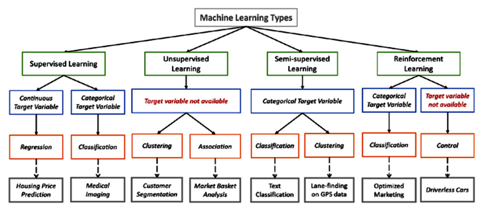

This website aims to provide information about machine learning terms glossary within the [H3ABioNet](https://h3abionet.org/) consortium, by introducing the ML jargon and explaining it using very simple terms and including examples from the biomedical research field. We believe this Glossary will help folks from non computing background get familiar with ML terms and methods in order to enhance the use of ML to answer biological questions.

Biologists no longer rely on traditional laboratories to discover novel biomarkers for a given disease, but make use of the continuously growing genomic datasets that are publicly available to determine the biomarkers. Technologies for capturing data in biology are becoming cheaper and more effective, and this has given rise to a new era of big data in bioinformatics. These large biological datasets can be effectively analysed using machine learning aproaches.

<!-- load the d3.js library -->	

* [Introduction to Machine Learning]({{ site.baseurl}})
* [Supervised Learning]({{ site.baseurl}})
* [Unsupervised Learning]({{ site.baseurl}})
* [Data preprocessing]({{ site.baseurl}})
* [Choosing the right estimator]({{ site.baseurl}})

You can use the buttons at the top of the page to navigate through the Glossary different terms, or the side panel to access the subsections within each.

This ML glossary repo was [forked from this H3ABioNet-SOPs repo](https://github.com/h3abionet/H3ABionet-SOPs). Contributions are welcome! To do so, open an issue or a pull request. Additionally, check out our [contribution guide]({{ site.baseurl}}).

-------------------
# Types of Machine Learning Algorithms:
There are several main types of machine learning algorithms in common use: supervised, unsupervised, semi-supervised, reinforcement learning and statistical methods:

## A. Supervised learning approaches
These approaches use a training dataset where the outcome is known, and the relationship between a set of predictors (independent variables, risk factors) and the outcome can be modelled, and then tested on a test set as well as used to predict the outcome where it is not known.

<!-- Table begin :Work around for adding tables with merged columns/rows -->
<table>
    <tr>
      <td colspan="2"> <strong>Supervised Machine Learning</strong>  Labelled training set used to induce classification rules.</td>
    </tr>
    <tr>
      <td colspan="2"><strong>Dataset:</strong>  Contains elements (instances), which fall in classes assigned by features and classification rules</td>
    </tr>
    <tr>
      <td colspan="2"><strong>Feature Subset Selection:</strong> 
          Evaluation function measures effectiveness of feature subset by:
          <ul>
              <li>wrapper: error reported by evaluation function</li>
              <li>filter</li>
              <li>search-halting: non-improvement of classifier (algorithm)</li>
          </ul>
      </td>
    </tr>
    <tr>
        <td colspan="2"><strong>Search strategy:</strong></td>
    </tr>
    <tr>
        <td colspan="2">Optimal: exhaustive, all possible subsets
            <ul>
                <li>depth-first</li>
                <li>breadth-first</li>
                <li>branch and bound for monotonic evaluation functions</li>
            </ul>
        </td>
    </tr>
    <tr>
        <td colspan="2">
            <strong>Predict outcome:</strong> 
            Assess/compare algorithms using receiver operating characteristics (ROC). 
            Metrics derived from contingency tables for discrete labels; correlation, MSE, error analysis for continuous data labels.
        </td>
    </tr>
    <tr>
        <td>
            Test dataset: validation to determine classification error
        </td>
        <td>
            No test dataset: 
            <ul>
                <li>resubstitution estimator</li>
                <li>leave one out/k-fold cross validation</li>
                <li>bootstrap methodology</li>
            </ul>
        </td>
    </tr>            
    <tr>
        <td colspan="2">
          <strong>Commonly used algorithms:</strong>
        </td>
    </tr>
    <tr>
        <td colspan="2">
            <ul>
                <li>Linear regression</li> 
                <li>Logistic regression</li>
                <li>Decision tree</li>
                <li>Support Vector Machines</li>
                <li>Naïve Bayes</li>
                <li>K-Nearest Neighbours</li>
                <li>Random Forest</li>
                <li>Dimensionality Reduction Algorithms</li>
                <li>Gradient Boosting Algorithms</li>
                <li>Neural Networks</li>
                <li>Association Rules</li>
            </ul>
        </td>
    </tr>
</table>
<!-- Table end :Work around for adding tables with merged columns/rows -->

## C. Semi-supervised learning algorithms 
These fall between supervised and unsupervised ML algorithms, where only a subset of the data are labelled – so that where data are unlabelled, their features may still contribute understanding about the group parameters. 

<!-- Semi-supervised learning table begin-->
<table>
    <tr>
        <td><strong>Semi-supervised Machine Learning:</strong> 
            Framework for leveraging unlabeled data when labels are limited or expensive to obtain. In addition to unlabeled data, it is provided with some supervision information – but not necessarily for all examples.
        </td>
    </tr>
    <tr>
        <td>
            Typically uses a small amount of labeled data along with a large amount of unlabeled data.
        </td>
    </tr>
    <tr>
        <td>
            <strong>Commonly used algorithms</strong>:
            <ul>
                <li>Generative Models</li>
                <li>Low-Density Separation</li>
                <li>Graph-Based Methods</li>
                <li>Change of Representation</li>
            </ul>
        </td>
    </tr>
    <tr>
        <td>
            <strong>Use of semi-supervised algorithms:</strong>  
                    Protein sequences are currently acquired at industrial speed (by genome sequencing, computational gene finding, and automatic translation), but to resolve a three dimensional (3D) structure or to determine the functions of a single protein may require years of scientific work, unless we use semi-supervised learning methods.
        </td>
    </tr>
</table>
<!-- Semi-supervised learning table end -->

## D. Reinforcement learning algorithms
These are used to train a machine to make specific decisions and then continually improve this process through trial-and-error – learning from past experience and capturing knowledge to improve decision-making. The reinforcement learning algorithm (or agent) learns iteratively from experience, with feedback that acts as the reinforcement signal to modify the algorithm’s behaviour.

<!-- Reinforcement Learning table begin-->
<table>
    <tr>
        <td>
            <strong>Reinforcement Machine Learning:</strong> 
                    Learning from environment in an iterative process and modifying actions accordingly
        </td>
    </tr>
    <tr>
        <td>
            <strong>Dataset:</strong> contains unlabelled data. 
        </td>
    </tr>  
    <tr>
        <td>
            <strong>Markov Decision Process:</strong> Agent records input state, performs an action, receives measure from environment. The state-action paired data are stored.   
        </td>
    </tr> 
    <tr>
        <td>
            <strong>Commonly used algorithms: </strong>
        </td>
    </tr>
    <tr>
        <td>
            <ul>
                <li>Q-Learning </li>
                <li>Temporal Difference </li>
                <li>Deep Adversarial Networks</li>
            </ul>
        </td>
    </tr>
</table>
<!-- Reinforcement Learning table end -->

## E. Statistical methods

Statistics is a branch of Mathematics that deals with the description of datasets, and the inferrence of global properties of data, given random samples. Statistical methods and predictive modelling techniques are tightly entertwined with machine learning models and their quality control process, such that it is not easy to separate the two. Therefore we provide some examples of models that are more closely aligned to statistical concepts. Logistic regression, markov chains, monte carlo methods and naive Bayes are all machine learning algorithm examples where probabilities are emitted or used to infer the probability of a state. Furthermore, other algorithms such as the principal components analysis (PCA) and the Independent Component Analysis (ICA) are both statistical and are generally used to find patterns in data ...
  

<figure>
  
  <figcaption><strong>Figure 1b.</strong> Machine Learning Types</figcaption>
</figure>
  
<figure>
  
  <figcaption><strong>Figure 2:</strong> Classification of methods in common use in Machine Learning</figcaption>
</figure>  
    

## Summary of some applications of ML in Bioinformatics

| Type of ML | Algorithm name | Bioinformatics application|
|---|---|---|
|Supervised|Linear regression|Correlating the codon usage pattern with the protein regulation level using linear regression models [Bioinformatics study of the relationship between protein regulation and sequence properties](https://doi.org/10.1016/j.ygeno.2012.07.003)|
||Logistic Regression|Logistic regression for disease classification using microarray data: model selection in a large p and small n case [article](https://doi.org/10.1093/bioinformatics/btm287)|
||Decision Tree|Classification between disease group and non-disease group as well as to distinguish among different disease sub-types, using features generated from protein sequence and structure data [article](https://www.ncbi.nlm.nih.gov/pubmed/20139917)|
||Support Vector Machines (SVM)|Can also be used to classify between disease group and non-disease group like a Decision Tree. Other applications of SVM are: (1) prediction of membrane protein types in whole sequences. (2) prediction of translation initiation sites in biological sub-sequences [article](https://doi.org/10.1093/bib/5.4.328)|
||Naïve Bayes|Rapid Assignment of rRNA Sequences into the New Bacterial Taxonomy [article](http://aem.asm.org/content/73/16/5261.full.pdf)|
||K-Nearest Neighbour|Gene function prediction from heterogeneous data [article](https://doi.org/10.1186/1471-2105-7-S1-S11)|
||Random Forest|Used in pathway analysis and genetics association and epistasis detection [article](https://www.ncbi.nlm.nih.gov/pmc/articles/PMC3387489/)|
||Dimensionality Reduction Algorithms|E.g. PCA.  See Statistical; can be used for the visualization of microarray gene expression data [article](https://doi.org/10.1186/1471-2105-11-567).
Can also  be for biomarker discovery from high-throughput biological data [article](https://doi.org/10.1093/bib/bbn005)|
||Gradient Boosting algorithms|Predicting protein solvent accessibility which is a pivotal intermediate step towards modeling protein tertiary structures directly from one-dimensional sequences  [article](https://doi.org/10.1186/s12859-015-0851-2 )|
||Neural networks|Can be used for promoter recognition [article](https://www.ncbi.nlm.nih.gov/pubmed/2818859). Drug resistance prediction in HIV [article](https://www.ncbi.nlm.nih.gov/pmc/articles/PMC5558779/) |
||Association rules|Used to identify promising secondary phenotype candidates. Predictions rely on a large gene–phenotype annotation set that is used to find occurrence patterns of phenotypes.  [article](https://www.ncbi.nlm.nih.gov/pubmed/24932005 )|
|Unsupervised|K-means clustering|Used in gene expression studies to identify the functions of previously unstudied genes  - to reduce the data set [article](https://www.ncbi.nlm.nih.gov/pmc/articles/PMC3180043/)|
|Statistical|Principal Component Analysis|Used in studies to explain variation of gene expressions [article](https://www.ncbi.nlm.nih.gov/pubmed/21242203)|
||Independent Component Analysis||

## Glossary
|Term|Explanation|
|---|---|
|Big Data|Big data refers to large and complex datasets characterized by: (1) Volume: defines the huge amount of data that is produced. The data is so large and complex that it can no longer be saved or analyzed using conventional data processing methods. (2) Variety refers to the diversity of data types and data sources. (3) Velocity refers to the speed with which the data is generated, analyzed and reprocessed. (4) Veracity: uncertainty of data|
---------------------

### Funding
The H3ABioNet Machine Learning Glossary was developped by the H3ABioNet Machine Learning and Big Data project members. The development of  is supported by the H3Africa program grant U24HG006941 from the National Human Genome Research Institute (NHGRI) of the National Institutes of Health (NIH) entitled “H3ABioNet: Informatics Solutions for H3Africa”. The content is solely the responsibility of the authors and does not necessarily represent the official views of the National Institutes of Health.

### References

[//]: <> (These are common abbreviations in the page.)
*[ML]: Machine Learning
*[H3Africa]: Human Heredity and Health in Afrcia Consortium
*[H3ABioNet]: The Bioinformatics Network within the H3Africa Consortium
